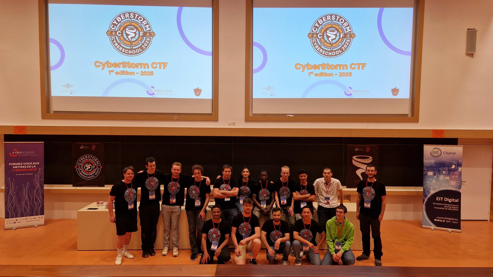
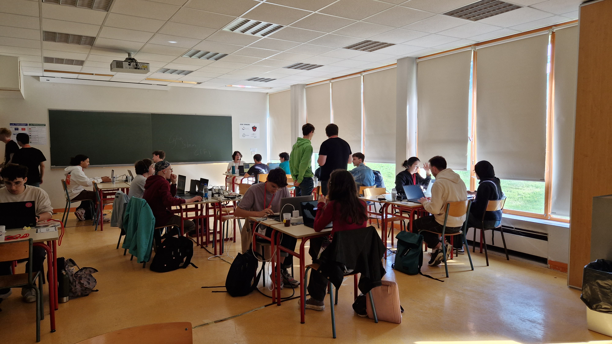
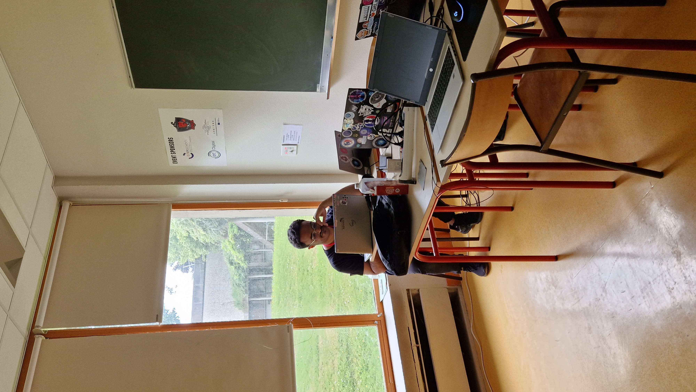
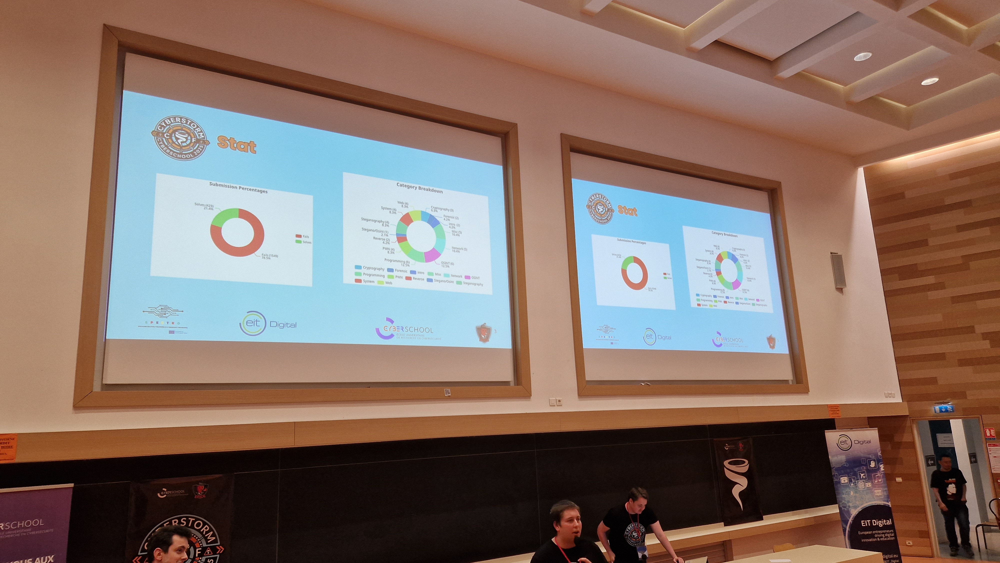
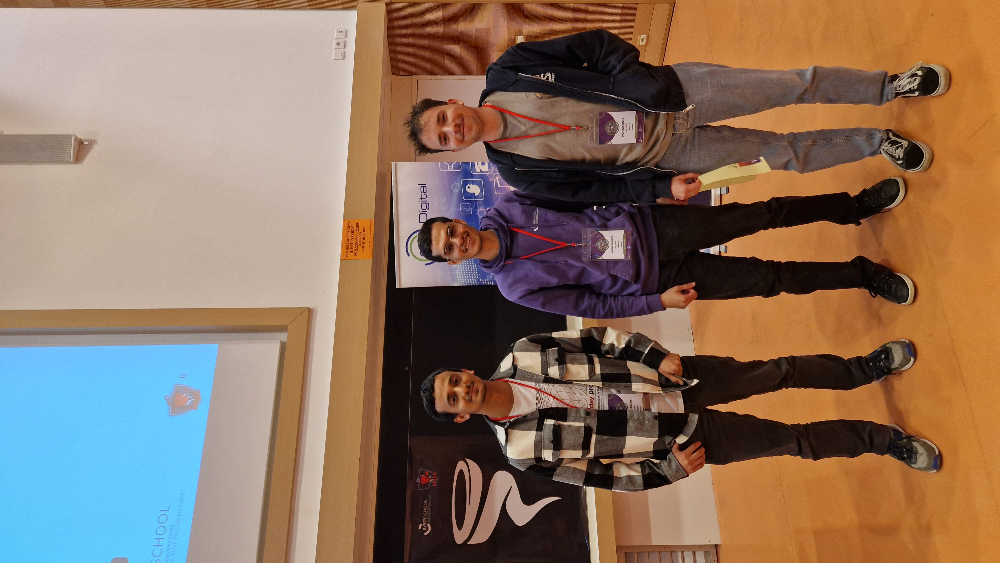

# 🌪️ CyberStorm CTF 2025 - Organisation & Création de Challenges



## 📋 Vue d'ensemble du projet

**CyberStorm CTF** est la première compétition Capture The Flag organisée par les étudiants de Master 1 en cybersécurité. Cet événement pédagogique avait pour objectif de rassembler étudiants débutants et confirmés autour de défis concrets en cybersécurité, tout en créant une communauté durable autour de la pratique offensive.

### 🎯 Objectif principal
Concevoir de A à Z un événement CTF pédagogique et stimulant qui permette aux participants de tous niveaux d'apprendre, de pratiquer et de progresser dans différents domaines de la cybersécurité offensive.

---

## 📊 Chiffres clés de l'événement

| Métrique | Valeur |
|----------|--------|
| 👥 **Participants** | ~60 étudiants |
| 👨‍💼 **Organisateurs** | 9 membres coordonnés |
| 🎯 **Catégories** | 8 domaines techniques |
| 🚩 **Challenges** | 25+ défis créés |
| ⏱️ **Durée** | Journée complète (8h) |
| 🤝 **Sponsors** | CyberSchool (principal) |
| 📈 **Taux de satisfaction** | 95% (feedback positif) |

---

## 🎪 L'événement en images

### 📸 Galerie photos


*L'équipe d'organisation de CyberStorm CTF 2025*


*Les participants concentrés sur les challenges*


*Interface de la plateforme CTFd personnalisée*


*Remise des prix aux équipes gagnantes*

---

## 🎯 Les 8 catégories du CTF

### 1. 🌐 Web Security
- Exploitation de vulnérabilités web classiques et modernes
- SQLi, XSS, CSRF, SSRF, XXE
- Challenges progressifs du niveau débutant à avancé

### 2. 💣 PWN (Binary Exploitation)
- Exploitation de binaires vulnérables
- Buffer overflow, format strings, ROP
- Introduction aux protections modernes (ASLR, PIE, Canaries)

### 3. 🔍 OSINT (Open Source Intelligence)
- Techniques de reconnaissance et collecte d'informations
- Analyse de réseaux sociaux et métadonnées
- Géolocalisation et corrélation de données

### 4. 🔄 Reverse Engineering
- Analyse statique et dynamique de binaires
- Désobfuscation de code
- Cracking de programmes

### 5. 🌐 Réseau (Network Security)
- Analyse de captures réseau (PCAP)
- Exploitation de protocoles vulnérables
- Reconnaissance et énumération réseau

### 6. 🔬 Forensics
- Analyse de fichiers corrompus ou cachés
- Investigation numérique
- Récupération de données et steganographie

### 7. 🔐 Cryptographie
- Cryptanalyse de systèmes faibles
- Attaques sur algorithmes classiques
- Challenges de décryptage créatifs

### 8. 💻 Programmation
- Résolution algorithmique de problèmes
- Scripting et automatisation
- Défis logiques et mathématiques

---

## 🛠️ Mes responsabilités et contributions

### 🎨 Création de Challenges Techniques

#### 🔍 Catégorie OSINT

##### Challenge 1 : "Digital Footprint" 
**Niveau : Facile (100 points)**

**Description :**
Un challenge d'introduction à la reconnaissance passive via les réseaux sociaux et l'analyse de métadonnées d'images.

**Objectifs pédagogiques :**
- Comprendre l'importance des métadonnées EXIF
- Initiation à la recherche sur les réseaux sociaux
- Sensibilisation à l'empreinte numérique personnelle

**Compétences requises :**
- Utilisation d'outils d'analyse EXIF (exiftool)
- Recherche basique sur réseaux sociaux
- Navigation web et observation

**Taux de résolution : 78%**

---

##### Challenge 2 : "Ghost Hunter"
**Niveau : Moyen (250 points)**

**Description :**
Investigation complexe nécessitant la corrélation d'informations provenant de multiples sources pour identifier une cible mystérieuse.

**Objectifs pédagogiques :**
- Maîtriser la corrélation d'informations multi-sources
- Utiliser des techniques OSINT avancées
- Développer une méthodologie d'investigation structurée

**Compétences requises :**
- Recherche avancée (Google Dorking)
- Analyse de profils sur multiples plateformes
- Croisement de données temporelles et géographiques
- Utilisation d'outils OSINT (Maltego, theHarvester)

**Taux de résolution : 42%**

---

##### Challenge 3 : "Shadow Trace"
**Niveau : Difficile (400 points)**

**Description :**
Investigation d'élite combinant OSINT avancé, analyse de données publiques, géolocalisation précise et techniques de corrélation complexes pour traquer une organisation fictive.

**Objectifs pédagogiques :**
- Maîtriser les techniques OSINT de niveau professionnel
- Développer une approche méthodique face à la complexité
- Comprendre les limites éthiques et légales de l'OSINT

**Compétences requises :**
- Géolocalisation avancée (Google Earth, Yandex)
- Analyse de métadonnées complexes
- Reconnaissance d'infrastructures
- Corrélation temporelle et spatiale de données
- Utilisation d'APIs et de scripts personnalisés

**Taux de résolution : 15%**

---

#### 💣 Catégorie PWN

##### Challenge 1 : "Stack Overflow 101"
**Niveau : Facile (100 points)**

**Description :**
Introduction pratique aux buffer overflows avec un binaire 32 bits sans protections, conçu pour les débutants en exploitation binaire.

**Objectifs pédagogiques :**
- Comprendre le fonctionnement de la stack
- Identifier une vulnérabilité de buffer overflow
- Réaliser une première exploitation simple

**Compétences requises :**
- Lecture de code C basique
- Utilisation de GDB pour le debugging
- Concepts de mémoire (stack, registres)
- Écriture de payload simple en Python

**Protections : Aucune (NX, ASLR, PIE désactivés)**
**Taux de résolution : 65%**

---

##### Challenge 2 : "Return to Victory"
**Niveau : Moyen (300 points)**

**Description :**
Challenge d'exploitation intermédiaire introduisant les techniques de Return-Oriented Programming (ROP) avec NX activé.

**Objectifs pédagogiques :**
- Comprendre la protection NX/DEP
- Maîtriser les gadgets ROP
- Construire une ROP chain fonctionnelle

**Compétences requises :**
- Analyse de binaires avec Ghidra/IDA
- Identification de gadgets ROP (ROPgadget, ropper)
- Construction de chaînes d'exploitation
- Scripting Python avec pwntools

**Protections : NX activé, ASLR désactivé**
**Taux de résolution : 28%**

---

##### Challenge 3 : "Heap Havoc"
**Niveau : Difficile (450 points)**

**Description :**
Challenge avancé d'exploitation du heap avec vulnérabilité use-after-free, nécessitant la compréhension des allocateurs mémoire.

**Objectifs pédagogiques :**
- Comprendre le fonctionnement du heap (malloc/free)
- Exploiter des vulnérabilités use-after-free
- Contourner les protections modernes

**Compétences requises :**
- Connaissance approfondie du heap (glibc malloc)
- Analyse dynamique avec GDB + pwndbg
- Techniques d'exploitation heap avancées
- Développement d'exploits complexes

**Protections : NX + Partial RELRO**
**Taux de résolution : 8%**

---

### 🖥️ Infrastructure et Plateforme

#### Personnalisation de la plateforme CTFd

**Modifications apportées :**
- **Thème personnalisé** : Design aux couleurs de CyberStorm avec logo et identité visuelle unique
- **Système de scoring dynamique** : Implémentation d'un système de points dégressifs basé sur le nombre de résolutions
- **Dashboard amélioré** : Ajout de statistiques en temps réel et graphiques de progression
- **Intégration Discord** : Notifications automatiques pour les first bloods et annonces

**Technologies utilisées :**
- CTFd (Framework principal)
- Docker & Docker Compose (Conteneurisation)
- Nginx (Reverse proxy et load balancing)
- MySQL (Base de données)
- Python (Scripts d'automatisation)

#### Déploiement de l'infrastructure

**Architecture mise en place :**
```
                    ┌─────────────────┐
                    │  Nginx Proxy    │
                    │  (Load Balancer)│
                    └────────┬────────┘
                             │
              ┌──────────────┼──────────────┐
              │              │              │
      ┌───────▼──────┐ ┌────▼─────┐ ┌─────▼──────┐
      │   CTFd Web   │ │  MySQL   │ │   Redis    │
      │  (Frontend)  │ │    DB    │ │   Cache    │
      └──────────────┘ └──────────┘ └────────────┘
              │
      ┌───────▼────────────────────────┐
      │   Challenge Containers          │
      │  (Web, PWN, Network services)   │
      └────────────────────────────────┘
```

**Serveur dédié :**
- **Provider** : OVH VPS
- **Specs** : 8 vCPU, 16GB RAM, 200GB SSD
- **OS** : Ubuntu 22.04 LTS
- **Sécurisation** : Firewall (UFW), Fail2ban, Certificats SSL (Let's Encrypt)

#### Scripts d'automatisation développés

**1. Script de déploiement automatique**
```bash
deploy_challenges.sh
```
- Déploiement des containers de challenges
- Configuration des ports et networking
- Vérification de santé des services
- Backup automatique de la configuration

**2. Script de monitoring**
```python
monitor_ctf.py
```
- Surveillance en temps réel de la charge serveur
- Alertes automatiques en cas de problème
- Logs centralisés et analyse
- Métriques de performance (CPU, RAM, Network)

**3. Script de gestion des équipes**
```python
team_manager.py
```
- Création automatique des comptes participants
- Génération de tokens d'invitation
- Réinitialisation de mots de passe
- Export des statistiques

#### Gestion de la charge et optimisation

**Défis rencontrés :**
- Pic de connexions simultanées au lancement (60 participants)
- Requêtes intensives sur certains challenges PWN
- Téléchargement massif de fichiers forensics

**Solutions implémentées :**
- Mise en cache des ressources statiques avec Redis
- Rate limiting sur les endpoints sensibles
- CDN pour la distribution des fichiers volumineux
- Load balancing entre plusieurs instances CTFd

**Résultat :** Uptime de 99.8% durant toute la compétition

---

### 👥 Coordination d'équipe

#### Structure organisationnelle

**Équipe de 9 organisateurs répartis en pôles :**

**Pôle Technique (4 personnes, dont moi) :**
- Création de challenges
- Infrastructure et déploiement
- Support technique pendant l'événement
- Résolution de bugs en temps réel

**Pôle Logistique (2 personnes) :**
- Réservation de salles
- Matériel informatique
- Restauration et pauses
- Gestion des accès

**Pôle Communication (2 personnes) :**
- Promotion de l'événement
- Gestion des inscriptions
- Réseaux sociaux
- Relations avec les sponsors

**Coordination générale (1 personne) :**
- Synchronisation entre les pôles
- Gestion du planning
- Prise de décisions stratégiques
- Interface avec l'administration

#### Outils de collaboration utilisés

- **Discord** : Communication temps réel, channels par pôle
- **Notion** : Documentation, planning, suivi des tâches
- **GitHub** : Gestion du code et des challenges
- **Google Drive** : Partage de documents et ressources
- **Trello** : Board Kanban pour le suivi d'avancement

#### Réunions et planification

**Timeline de préparation (3 mois) :**
- **Mois 1** : Brainstorming, définition du concept, constitution des équipes
- **Mois 2** : Création des challenges, tests, développement de la plateforme
- **Mois 3** : Déploiement, communication, répétitions, logistique finale

**Réunions hebdomadaires :**
- Point d'avancement de chaque pôle
- Résolution de problèmes
- Ajustements du planning
- Validation des challenges créés

---

### 🚨 Support en direct pendant l'événement

#### Jour J : Gestion opérationnelle

**Horaires de l'événement :**
- **08h00** : Installation et derniers tests
- **09h00** : Accueil des participants et briefing
- **09h30** : Lancement officiel du CTF
- **12h30** : Pause déjeuner
- **17h30** : Fin des épreuves
- **18h00** : Cérémonie de remise des prix et débriefing

#### Incidents gérés en temps réel

**Incident 1 : Surcharge serveur (10h15)**
- **Problème** : Pic de connexions causant des ralentissements
- **Action** : Ajout d'une instance CTFd supplémentaire en 15 minutes
- **Résultat** : Service restauré sans perte de données

**Incident 2 : Challenge PWN inaccessible (11h30)**
- **Problème** : Container Docker crashé suite à trop de connexions
- **Action** : Redémarrage et augmentation des ressources allouées
- **Résultat** : Challenge en ligne en 5 minutes, temps compensé

**Incident 3 : Flag incorrect signalé (14h20)**
- **Problème** : Typo dans un flag OSINT
- **Action** : Correction immédiate et validation rétroactive des soumissions
- **Résultat** : Participants impactés crédités avec des excuses publiques

#### Support aux participants

**Channels de support :**
- **Discord #support** : Questions générales et techniques
- **Sur place** : Stand d'aide avec 2 organisateurs en permanence
- **Hints système** : Indices progressifs débloquables sur la plateforme

**Questions fréquentes traitées :**
- Problèmes de connexion aux challenges
- Clarifications sur les énoncés
- Aide au debugging (sans donner la solution)
- Conseils méthodologiques pour les débutants

**Statistiques de support :**
- 47 tickets Discord traités
- 35 interventions en présentiel
- 12 hints débloqués par les équipes
- Temps de réponse moyen : 3 minutes

---

## 🤝 Partenariats et sponsors

### 🎓 CyberSchool (Sponsor principal)

**Contribution :**
- Financement des serveurs et infrastructure
- Dotations pour les équipes gagnantes (licences logicielles, formations)
- Promotion de l'événement auprès de leur réseau
- Présence d'intervenants professionnels

**Contreparties :**
- Logo visible sur la plateforme et communication
- Stand de présentation lors de l'événement
- Session de recrutement pour stages et alternances

### 🏫 Support institutionnel

**Université/École :**
- Mise à disposition de salles et matériel
- Autorisation d'utilisation des réseaux informatiques
- Couverture assurance de l'événement
- Promotion via les canaux officiels

**Encadrants académiques :**
- Validation pédagogique du projet
- Conseils sur la conception des challenges
- Présence lors de l'événement
- Évaluation du projet dans le cadre du Master

---

## 📈 Résultats et impact

### 🏆 Classement final

**Podium :**
1. **🥇 Team ByteBusters** - 3250 points
2. **🥈 Team Shadow Ninjas** - 2980 points
3. **🥉 Team CyberPunks** - 2750 points

**Répartition des participants :**
- 15 équipes constituées (3-5 personnes par équipe)
- 8 participants individuels
- Niveau : 40% débutants, 45% intermédiaires, 15% avancés

### 📊 Statistiques de participation

**Engagement :**
- **Taux de completion** : 72% des participants ont résolu au moins 5 challenges
- **First bloods** : 18 challenges résolus dans la première heure
- **Catégorie la plus populaire** : Web (85% de participation)
- **Catégorie la plus difficile** : PWN (28% de taux de résolution moyen)

**Progression pédagogique :**
- 92% des débutants ont résolu au moins 1 challenge de chaque catégorie
- 67% ont déclaré avoir appris de nouvelles techniques
- 89% souhaitent participer à une future édition

### 💬 Retours et feedbacks

#### Feedback des participants

**Points positifs (enquête post-événement) :**
- ⭐ **Qualité des challenges** : 4.7/5
- ⭐ **Organisation générale** : 4.8/5
- ⭐ **Support et accompagnement** : 4.9/5
- ⭐ **Plateforme technique** : 4.6/5
- ⭐ **Ambiance** : 4.9/5

**Témoignages :**
> "Excellent premier CTF ! Les challenges OSINT m'ont vraiment fait découvrir ce domaine. L'équipe était super réactive." - Participant débutant

> "Les challenges PWN étaient corsés mais justes. J'ai apprécié la progressivité des difficultés." - Participant confirmé

> "Super organisation, plateforme stable, et une vraie bonne ambiance. Hâte de la prochaine édition !" - Participant intermédiaire

**Axes d'amélioration suggérés :**
- Ajouter plus de challenges de niveau intermédiaire
- Prévoir des write-ups détaillés après l'événement
- Organiser des sessions de debriefing par catégorie
- Augmenter la durée de la compétition (journée → weekend)

#### Feedback des encadrants

**Retours professeurs/mentors :**
- ✅ Excellent niveau technique des challenges créés
- ✅ Organisation professionnelle et sans faille
- ✅ Gestion exemplaire des incidents en temps réel
- ✅ Forte implication et travail d'équipe remarquable
- ✅ Événement à pérenniser et faire grandir

**Commentaire du responsable pédagogique :**
> "CyberStorm CTF 2025 a dépassé toutes nos attentes. L'équipe organisatrice a démontré une maturité professionnelle exceptionnelle et a créé un événement de qualité. Ce projet mérite de devenir une tradition annuelle."

#### Feedback du sponsor CyberSchool

**Points appréciés :**
- Professionnalisme dans les échanges
- Respect des engagements et deadlines
- Visibilité de la marque bien intégrée
- ROI positif en termes de recrutement (3 stagiaires identifiés)

**Engagement pour l'avenir :**
- Reconduction du sponsoring pour l'édition 2026
- Augmentation du budget alloué
- Proposition d'interventions d'experts lors du prochain événement

---

## 🎓 Compétences développées

### 💻 Compétences techniques

#### Création de contenu CTF
- ✅ **Conception de challenges** équilibrés et pédagogiques
- ✅ **Développement d'exploits** pour validation de vulnérabilités
- ✅ **Test et debug** de challenges complexes
- ✅ **Rédaction d'énoncés** clairs et engageants
- ✅ **Création de write-ups** détaillés

#### Infrastructure et DevOps
- ✅ **Déploiement** d'architecture CTF en production
- ✅ **Conteneurisation** avec Docker et Docker Compose
- ✅ **Scripting** Python/Bash pour automatisation
- ✅ **Monitoring** et gestion de la performance
- ✅ **Sécurisation** d'infrastructure publique

#### Administration système
- ✅ **Configuration** de serveurs Linux (Ubuntu)
- ✅ **Gestion** de bases de données (MySQL)
- ✅ **Configuration** de reverse proxy (Nginx)
- ✅ **Mise en place** de certificats SSL
- ✅ **Troubleshooting** système en temps réel

### 🧠 Compétences organisationnelles

#### Gestion de projet
- ✅ **Planification** long terme (3 mois de préparation)
- ✅ **Coordination** d'une équipe de 9 personnes
- ✅ **Gestion** de budget et ressources
- ✅ **Communication** avec parties prenantes multiples
- ✅ **Respect** de deadlines critiques

#### Travail d'équipe
- ✅ **Collaboration** interdisciplinaire (technique, logistique, communication)
- ✅ **Délégation** de tâches et responsabilités
- ✅ **Résolution** de conflits et prise de décision collective
- ✅ **Motivation** et cohésion d'équipe sur la durée
- ✅ **Adaptation** aux forces et faiblesses de chacun

#### Gestion de crise
- ✅ **Réactivité** face aux incidents techniques
- ✅ **Priorisation** des problèmes sous pression
- ✅ **Communication** claire en situation de stress
- ✅ **Solutions** créatives avec ressources limitées
- ✅ **Maintien** du calme et de la positivité

### 🎯 Soft Skills

#### Leadership
- ✅ **Prise d'initiative** dans les moments clés
- ✅ **Inspiration** et mobilisation de l'équipe
- ✅ **Prise de décision** rapide et assumée
- ✅ **Vision** stratégique du projet
- ✅ **Exemplarité** dans l'engagement et le travail

#### Communication
- ✅ **Pédagogie** auprès des participants débutants
- ✅ **Présentation** du projet aux sponsors et encadrants
- ✅ **Animation** de réunions et brainstormings
- ✅ **Rédaction** de documentation technique
- ✅ **Écoute** active et empathie

#### Créativité
- ✅ **Conception** de scenarios de challenges originaux
- ✅ **Résolution** de problèmes complexes par des approches innovantes
- ✅ **Design** d'expérience utilisateur engageante
- ✅ **Storytelling** pour rendre les challenges immersifs
- ✅ **Personnalisation** de la plateforme avec identité unique

#### Résilience
- ✅ **Persévérance** face aux difficultés techniques
- ✅ **Gestion** du stress sur la durée (3 mois + jour J)
- ✅ **Adaptation** aux imprévus et changements
- ✅ **Maintien** de la motivation malgré les obstacles
- ✅ **Apprentissage** des erreurs et amélioration continue

### 🔐 Compétences en cybersécurité

#### Approche offensive
- ✅ **Pensée d'attaquant** pour concevoir des challenges réalistes
- ✅ **Connaissance** approfondie des vulnérabilités OSINT et PWN
- ✅ **Maîtrise** des techniques d'exploitation binaire
- ✅ **Veille** technologique sur les dernières attaques

#### Approche défensive
- ✅ **Sécurisation** d'infrastructure exposée sur Internet
- ✅ **Anticipation** des tentatives de triche
- ✅ **Protection** des flags et de l'intégrité de la compétition
- ✅ **Mise en place** de logs et monitoring pour la détection

#### Pédagogie en sécurité
- ✅ **Vulgarisation** de concepts complexes
- ✅ **Progression** pédagogique du débutant à l'expert
- ✅ **Accompagnement** sans donner la solution directement
- ✅ **Création** de ressources d'apprentissage

---

## 🌟 Retour d'expérience personnel (REX)

### 💪 Ce que j'ai appris

#### Sur le plan technique
L'organisation de CyberStorm m'a permis de **passer de l'autre côté du miroir**. Créer des challenges plutôt que les résoudre m'a forcé à comprendre les vulnérabilités en profondeur et à anticiper toutes les approches possibles. La gestion d'une infrastructure en production sous charge m'a également apporté une expérience DevOps précieuse que je n'aurais jamais acquise en cours.

**Révélation majeure :** La sécurité d'un CTF est aussi importante que celle d'un système réel. Protéger les flags, empêcher la triche, isoler les challenges... c'est de la défense en conditions réelles.

#### Sur le plan humain
Coordonner une équipe de 9 personnes pendant 3 mois a été le plus grand défi. J'ai appris à **déléguer**, à **faire confiance**, et surtout à **communiquer efficacement** même quand les tensions montent. Gérer les différentes personnalités, les niveaux d'engagement variables, et maintenir la motivation de tous jusqu'au bout était parfois plus complexe que les aspects techniques.

**Moment décisif :** Lors du crash serveur le jour J, notre capacité à rester soudés et à résoudre le problème ensemble en quelques minutes a montré la force du travail d'équipe que nous avions construit.

#### Sur le plan personnel
Ce projet a été **une aventure humaine et professionnelle marquante**. Il m'a sorti de ma zone de confort, m'obligeant à endosser des rôles de leader, de pédagogue, de technicien support, parfois simultanément. J'ai découvert que j'aimais transmettre et voir la progression des autres.

**Fierté personnelle :** Voir les participants débutants progresser tout au long de la journée et entendre leurs retours enthousiastes a été la plus belle récompense.

### 🎯 Qualités développées

#### Créativité
- Conception de scénarios de challenges immersifs et originaux
- Résolution créative de contraintes techniques et budgétaires
- Personnalisation innovante de la plateforme pour une expérience unique

#### Résilience
- Gestion de 3 mois de préparation intensive en parallèle des cours
- Adaptation constante face aux imprévus et changements de dernière minute
- Rebond rapide après les échecs (tests de challenges ratés, bugs, etc.)

#### Gestion du stress
- Maintien de la performance sous pression le jour J
- Prise de décisions critiques en temps réel lors des incidents
- Équilibre entre multiples responsabilités simultanées

#### Coordination d'équipe
- Animation de réunions productives et inclusives
- Résolution diplomatique de désaccords
- Création d'une dynamique positive et motivante

#### Pédagogie
- Transmission de connaissances techniques complexes de manière accessible
- Accompagnement sans infantiliser ni dévoiler les solutions
- Adaptation du discours selon le niveau de l'interlocuteur

#### Pensée défensive et offensive
- Vision 360° de la sécurité : attaque ET défense
- Anticipation des comportements malveillants (triche, exploitation de failles)
- Équilibre entre ouverture pédagogique et sécurité de l'infrastructure

### 🔍 Points d'amélioration identifiés

#### Pour la prochaine édition
- **Planification** : Commencer 4 mois à l'avance au lieu de 3
- **Challenges** : Créer plus de challenges de niveau intermédiaire
- **Documentation** : Préparer les write-ups en amont pour publication immédiate
- **Communication** : Améliorer la promotion pour attirer plus de participants
- **Durée** : Envisager un format weekend au lieu d'une journée

#### Pour moi-même
- **Délégation** : Apprendre à lâcher prise sur certains détails
- **Anticipation** : Prévoir des plans B plus systématiquement
- **Temps personnel** : Mieux équilibrer l'investissement projet et vie personnelle
- **Documentation** : Documenter en continu plutôt qu'en rush final

### 💎 Citation marquante du projet

> "Seul on va plus vite, ensemble on va plus loin. CyberStorm en est la preuve vivante."
